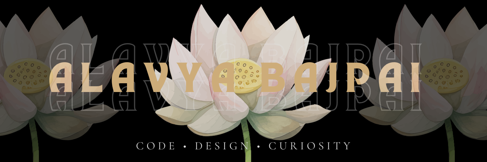

<p align="center">
  
</p>

<p align="center">
  Building thoughtful digital experiences and turning ideas into products.
</p>

<div align="center">

────────────── ❀ ──────────────

## ⌘ whoami

```bash
$ whoami
Alavya

$ role
Full Stack Developer

$ currently_building
Alavket

$ currently_learning
React • Node.js

$ status
Building.
```
────────────── ❀ ──────────────

</div>


---

## Current Focus

| Category | Focus |
|----------|-------|
| Building | Alavket |
| Learning | React, Node.js |
| Next Goal | ML |

<div align="center">

────────────── ❀ ──────────────

</div>


## ⚡ Tech Stack

<div align="center">

### Languages

<p align="center">

</p>

### Frontend

<p align="center">

</p>

### Backend

<p align="center">

</p>

### Databases

<p align="center">

</p>

### Tools And Platforms

<p align="center">

</p>

────────────────────────────

Some ideas become projects.

I'm working on those.

────────────────────────────

</div>
